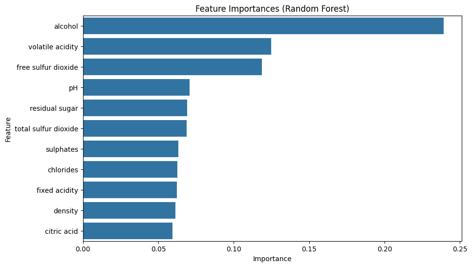
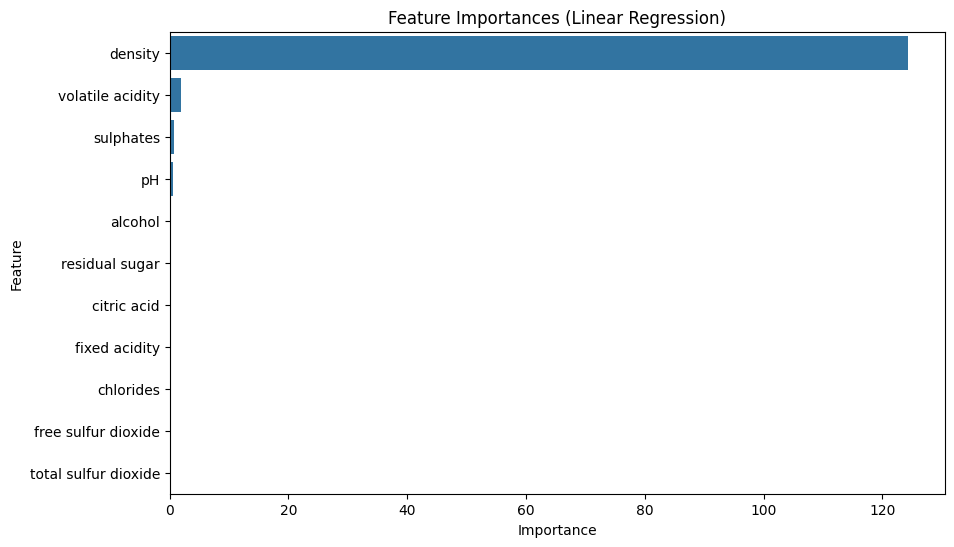
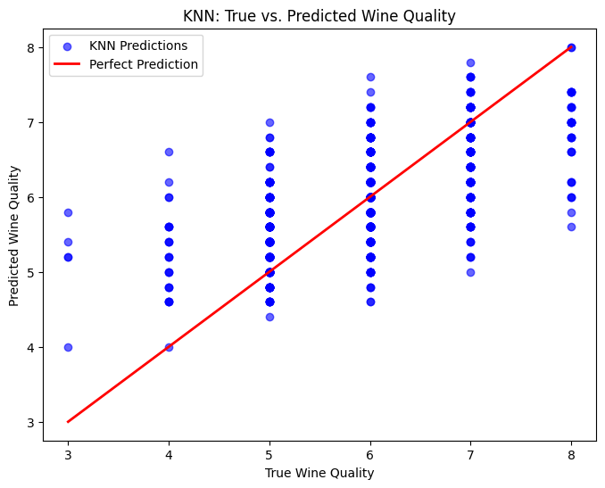
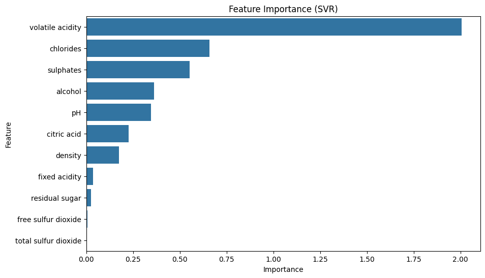

# Predicting the Quality of Wine

## Project Overview

This project aims to predict the quality of white wine based on various physicochemical properties, such as acidity, alcohol content, residual sugar, pH, and more. The dataset used in this project is publicly available from the [UCI Machine Learning Repository](https://archive.ics.uci.edu/ml/machine-learning-databases/wine-quality/winequality-white.csv).

We explore different machine learning models to predict wine quality, including:
- Random Forest Regressor
- Linear Regression
- K-Nearest Neighbors (KNN)
- Support Vector Regression (SVR)

We perform exploratory data analysis (EDA), feature importance analysis, and model evaluation using metrics like R² and RMSE.

## Dataset

The dataset consists of the following features:
- **Fixed acidity**: Acid content in wine.
- **Volatile acidity**: Volatile acid content in wine.
- **Citric acid**: Citric acid content in wine.
- **Residual sugar**: Sugar content remaining after fermentation.
- **Chlorides**: Amount of chlorides in wine.
- **Free sulfur dioxide**: Free SO2 content.
- **Total sulfur dioxide**: Total SO2 content.
- **Density**: Density of the wine.
- **pH**: pH level of the wine.
- **Sulphates**: Sulphate content in wine.
- **Alcohol**: Alcohol content in wine.
- **Quality**: Wine quality (score between 0 and 10).

## Installation

To run this project locally, follow these steps:

1. Clone this repository:
    ```bash
    git clone https://github.com/Aaryan-Agr/Wine-Quality-Prediction.git
    ```
   
2. Navigate to the project directory:
    ```bash
    cd Wine-Quality-Prediction
    ```

3. Install required dependencies:
    ```bash
    pip install -r requirements.txt
    ```

4. Run the Jupyter notebook:
    ```bash
    jupyter notebook Wine Quakity Prediction Models.ipynb
    ```

## Models Used

The following machine learning models were used for predicting wine quality:

### 1. **Random Forest Regressor**
   - A tree-based ensemble method that predicts continuous values by averaging the results from multiple decision trees.

   

### 2. **Linear Regression**
   - A simple regression model used to predict a target variable based on linear relationships between features.

   

### 3. **K-Nearest Neighbors (KNN)**
   - A non-parametric algorithm that classifies or regresses data based on the nearest neighbors in the feature space.

   

### 4. **Support Vector Regression (SVR)**
   - A type of Support Vector Machine used for regression tasks that tries to fit the best hyperplane to predict values.

   

## Evaluation

The models are evaluated using the following metrics:

- **R² Score**: Measures how well the model's predictions match the actual values.
- **Root Mean Squared Error (RMSE)**: Measures the average difference between the observed and predicted values.

### Correct Prediction Percentage

For each model, we also calculate the percentage of correct predictions where the difference between the predicted and actual quality is less than or equal to 1.

## Conclusion

The analysis shows which features are most important in predicting wine quality, and the performance of the models is compared based on R² and RMSE values. The Random Forest Regressor yielded the best predictions for wine quality.

## Future Work

- Explore other models such as Gradient Boosting Regressor or XGBoost.
- Tune the hyperparameters of the models to improve performance.
- Include a broader dataset with both white and red wines.
